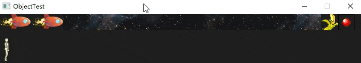
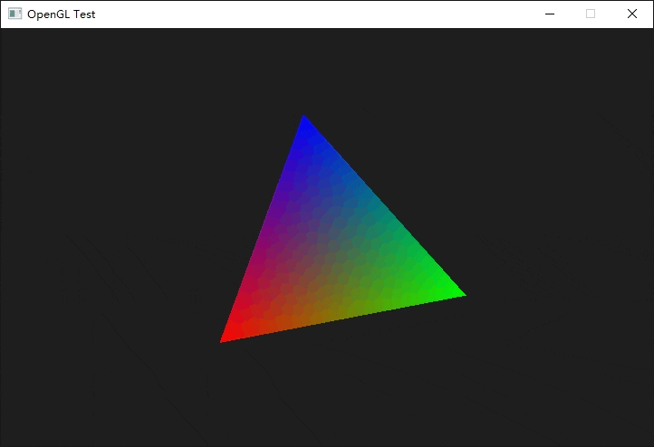
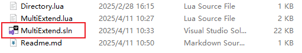
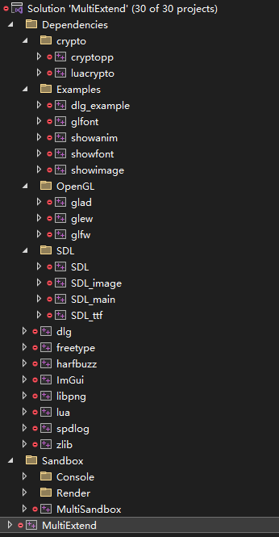

# MultiExtend


  <div style="justify-content: space-between; 
              font-family: monospace;font-size: 1em;
              font-style: italic;" >
    <p align="center">
      
      <br>
      <small>图灵数字艺术</small>
    </p>
    <p align="center">
      
      <br>
      <small>RestArt重启VFX</small>
    </p>
    
  </div>

  

  <p align="center" style="font-family: monospace;font-size: 1.2em;
                    font-style: italic;">
    <small><code>微信/小红书</code></small>
    <br>
    <small><a https="https://www.xiaohongshu.com/user/profile/63f43dce000000000f010c9a?xsec_token=ABAgEvauBbpzp2-rKa3MmFdv6_n0kGV3M013XnWfeBsfA=&xsec_source=pc_search">tuling166</a></small>
    <br>
    <small><code>Email</code></small>
    <br>
    <small><a>rvo0428@163.com</a></small>
    <br>
    <small><code>Email</code></small>
    <br>
    <small><a>captainrex0428@gmail.com</a></small>
  </p>


## 项目概述
Language: C++

Manager: PreMake

Status: Under Develop

MultiExtend是一个集成了SDL 2D框架、OpenGL和DirectX等3D框架、日常开发所需运算和功能的便捷拓展，目的是解决项目链接繁琐、编译繁琐等问题

内置timer clock trace log等一系列算法，也包含基本游戏主体框架（Object、Actor、Component、ActorComponent等），可以作为其他项目的拓展直接进行使用，同时也可以作为初学者理解游戏框架的入门

<p align="center" style=" font-family: monospace;
                          font-size: 1em;
                          font-style: italic;">
  
  <br>
  <small><em>SDL组件示例</em></small>
</p>

<p align="center" style=" font-family: monospace;
                          font-size: 1em;
                          font-style: italic;">
  
  <br>
  <small><em>OpenGL简单三角形渲染示例</em></small>
</p>

## Build

本项目使用`Premake`进行`solution`配置

克隆项目文件，打开`Script`文件夹，运行`.bat`文件将在跟目录获得`.sln`文件

<p align="center" style=" font-family: monospace;
                          font-size: 1em;
                          font-style: italic;">
  
  <br>
  <small><code>~/Script</code>文件夹</small>
</p>

<p align="center" style=" font-family: monospace;
                          font-size: 1em;
                          font-style: italic;">
  
  <br>
  <small>成功生成<code>.sln</code>文件</small>
</p>

打开`.sln`工程，会看到整体的结构
<p align="center" style=" font-family: monospace;
                          font-size: 1em;
                          font-style: italic;" >
  
  <br>
  <small>solution结构</small>
</p>

具体定义在`Build.lua`中
``` lua
include "Directory.lua"
include "Dependencies.lua"

workspace "MultiExtend"
	architecture "x64"
	startproject "MultiSandbox"
	configurations{
		"Debug",
		"Release",
        "Dist"
	}

    filter "system:windows"
    buildoptions { "/EHsc", "/Zc:preprocessor", "/Zc:__cplusplus","/utf-8" }
	

group ""
	include "MultiExtend.lua"

group "Sandbox/Render"
	include "Render/Render.lua"

group "Sandbox"
	include "MultiSandbox/MultiSandbox.lua"
	include "MultiTemplate/Template.lua"
	
group "Dependencies"
	include "Dependencies/lua.lua"
	include "Dependencies/dlg.lua"
	include "Dependencies/freetype.lua"
	include "Dependencies/harfbuzz.lua"
	include "Dependencies/spdlog.lua"
	include "Dependencies/imgui.lua"
	include "Dependencies/libpng.lua"
	include "Dependencies/zlib.lua"

group "Dependencies/SDL"
	include "Dependencies/SDL.lua"
	include "Dependencies/SDL_image.lua"
	include "Dependencies/SDL_ttf.lua"

group "Dependencies/crypto"
	include "Dependencies/cryptopp.lua"
	include "Dependencies/luacrypto.lua"

group "Dependencies/OpenGL"
	include "Dependencies/glad.lua"
	include "Dependencies/glfw.lua"
	include "Dependencies/glew.lua"

group "Dependencies/Examples"
	include "Dependencies/SDL_image_Example.lua"
	include "Dependencies/dlg_example.lua"
	include "Dependencies/SDL_ttf_Example.lua"
```

项目核心就是`MultiExtend`，直接编译`MultiExtend`就可以得到`MultiExtend.dll`及其导入库`MultiExtend.lib`
项目编译的地址定义在`Directory.lua`中
``` lua
LocationDir = "%{wks.location}/settings"

DependenciesRoot = "%{wks.location}/Extension/MultiExtend/Dependencies"
ExtensionRoot = "%{wks.location}/Extension"

OutputDir = "%{cfg.system}-%{cfg.architecture}/%{cfg.buildcfg}"

EXEDir = "%{wks.location}/bin/"..OutputDir
LibDir = "%{wks.location}/bin/"..OutputDir
DynamicDir = "%{wks.location}/bin/"..OutputDir
TargetDir = "%{wks.location}/bin/" .. OutputDir .. "/%{prj.name}"
ObjectDir = "%{wks.location}/bin/obj/" .. OutputDir .. "/%{prj.name}"
```
## 项目迁移

## 功能说明

## 版本计划

***

<p align="center">
  <div style="display: flex; justify-content: space-between; 
              font-size: 1em;
              font-style: italic;">
    <p align="center">
      
      <br>
      <small>RestArt重启VFX</small>
    </p>
    <p align="center">
      
      <br>
      <small>图灵数字艺术</small>
    </p>
  </div>

  <p align="center" style="font-size: 1.2em;
                    font-style: italic;">
    <small><code>微信/小红书</code></small>
    <br>
    <small><a>tuling166</a></small>
    <br>
    <small><code>Email</code></small>
    <br>
    <small><a>rvo0428@163.com</a></small>
    <br>
    <small><code>Email</code></small>
    <br>
    <small><a>captainrex0428@gmail.com</a></small>
  </p>

</p>
